<div align="center">

# 🚀 AskERP

### AI Decision Copilot for Enterprise Resource Planning

[](https://imaginecup.microsoft.com/)
[](https://azure.microsoft.com/)
[](https://openai.com/)
[](https://reactjs.org/)

**Transform complex ERP data into instant business insights with natural language AI**

[Features](#-features) • [Tech Stack](#-tech-stack) • [Quick Start](#-quick-start) • [Architecture](#-architecture)


</div>

---

## 🎯 The Problem

Business users struggle to extract insights from ERP systems:
- 📊 **Complex Data** - ERP systems contain valuable data but require technical expertise
- ⏰ **Delayed Decisions** - Waiting hours/days for IT to generate reports
- 🤷 **No Context** - Static reports show *what* happened, not *why*
- 💸 **Lost Opportunities** - Critical patterns and anomalies go unnoticed

---

## 💡 Our Solution

**AskERP** brings AI intelligence directly to your ERP data. Ask questions in plain English, get instant insights with root-cause analysis.

### ✨ Key Differentiators

```diff
+ 🗣️ Natural Language Queries - No SQL or technical knowledge needed
+ 🧠 AI-Powered Reasoning - Explains WHY things happened, not just WHAT
+ ⚡ Real-Time Insights - Instant analysis, no waiting for IT
+ 🚨 Proactive Alerts - Detects anomalies and predicts risks automatically
+ 📊 Visual Intelligence - Charts + explanations in one response
```

---

## 🎬 Demo

<div align="center">

### Try it yourself!

**Sample Questions:**
```
"Why did profit drop last month?"
"Which supplier is causing delays?"
"What expenses are unusually high?"
"Show me any risks for next month"
```

</div>

---

## ⚡ Features

<table>
<tr>
<td width="50%">

### 🗣️ Natural Language Interface
Ask questions like you're talking to a business analyst
- No technical jargon
- Conversational queries
- Context-aware responses

</td>
<td width="50%">

### 🧠 AI Root-Cause Analysis
Goes beyond basic reporting
- Identifies trends
- Explains anomalies
- Provides actionable insights

</td>
</tr>
<tr>
<td width="50%">

### 📊 Intelligent Visualizations
Auto-generated charts based on query
- Revenue trends
- Expense breakdowns
- Vendor performance
- Custom metrics

</td>
<td width="50%">

### 🚨 Anomaly Detection
Proactive risk identification
- Expense spikes
- Unusual vendor activity
- Inventory alerts
- Predictive warnings

</td>
</tr>
</table>

---

## 🛠️ Tech Stack

<div align="center">

### Cloud & AI


### Frontend


### Backend


</div>

---

## 🏗️ Architecture

```mermaid
graph TB
    A[👤 User] -->|Natural Language Query| B[React Frontend]
    B -->|HTTPS| C[Azure Functions API]
    C -->|Query Processing| D[Azure OpenAI GPT-4]
    C -->|Data Retrieval| E[Azure SQL Database]
    E -->|ERP Data| C
    D -->|SQL Generation| C
    D -->|Insight Generation| C
    C -->|Anomaly Detection| F[Python Analytics]
    F -->|Statistical Analysis| C
    C -->|Structured Response| B
    B -->|Visual + Text| A
    
    style A fill:#3b82f6,stroke:#1e40af,color:#fff
    style B fill:#10b981,stroke:#059669,color:#fff
    style C fill:#8b5cf6,stroke:#7c3aed,color:#fff
    style D fill:#f59e0b,stroke:#d97706,color:#fff
    style E fill:#ef4444,stroke:#dc2626,color:#fff
    style F fill:#06b6d4,stroke:#0891b2,color:#fff
```



### Data Flow

1. **User Query** → Natural language question
2. **Intent Classification** → AI determines query type
3. **SQL Generation** → GPT-4 converts to database query
4. **Data Retrieval** → Execute against Azure SQL
5. **Anomaly Detection** → Statistical analysis + AI insights
6. **Explanation Generation** → GPT-4 creates human-readable response
7. **Visualization** → Auto-generate appropriate charts
8. **Response Delivery** → JSON to frontend

---

## 🚀 Quick Start

### Prerequisites

```bash
- Node.js 18+
- Python 3.9+
- Azure CLI
- Azure Subscription
```

### Installation

#### 1️⃣ Clone the Repository

```bash
git clone https://github.com/yourusername/askerp.git
cd askerp
```

#### 2️⃣ Setup Frontend

```bash
cd frontend
npm install
cp .env.example .env
# Edit .env with your Azure Function URL
npm start
```

#### 3️⃣ Setup Backend

```bash
cd backend
pip install -r requirements.txt
cp local.settings.json.example local.settings.json
# Edit local.settings.json with your Azure credentials
func start
```

#### 4️⃣ Setup Database

```bash
cd database
# Run the schema script
sqlcmd -S your-server.database.windows.net -d askerp -U admin -P password -i schema.sql
# Load sample data
sqlcmd -S your-server.database.windows.net -d askerp -U admin -P password -i sample_data.sql
```

### Environment Variables

#### Frontend (.env)
```env
REACT_APP_API_URL=http://localhost:7071/api
REACT_APP_ENV=development
```

#### Backend (local.settings.json)
```json
{
  "IsEncrypted": false,
  "Values": {
    "AZURE_SQL_CONNECTION_STRING": "your-connection-string",
    "AZURE_OPENAI_KEY": "your-openai-key",
    "AZURE_OPENAI_ENDPOINT": "https://your-resource.openai.azure.com/",
    "AZURE_OPENAI_DEPLOYMENT": "gpt-4"
  }
}
```

---

## 📂 Project Structure

```
askerp/
├── 📁 frontend/                 # React application
│   ├── 📁 src/
│   │   ├── 📁 components/       # React components
│   │   ├── 📁 services/         # API services
│   │   ├── 📁 hooks/            # Custom hooks
│   │   └── App.js               # Main app component
│   └── package.json
│
├── 📁 backend/                  # Azure Functions
│   ├── 📁 shared/
│   │   ├── db_connector.py      # Database operations
│   │   ├── ai_processor.py      # OpenAI integration
│   │   └── anomaly_detector.py  # Statistical analysis
│   ├── function_app.py          # Main function handler
│   └── requirements.txt
│
├── 📁 database/                 # SQL scripts
│   ├── schema.sql               # Database schema
│   ├── sample_data.sql          # Sample ERP data
│   └── migrations/              # Database migrations
│
├── 📁 docs/                     # Documentation
│   ├── API.md                   # API documentation
│   ├── DEPLOYMENT.md            # Deployment guide
│   └── ARCHITECTURE.md          # Architecture details
│
└── README.md                    # You are here!
```

---

## 🔌 API Reference

### Query Endpoint

```http
POST /api/query
Content-Type: application/json

{
  "query": "Why did profit drop last month?"
}
```

**Response:**
```json
{
  "query": "Why did profit drop last month?",
  "data": [...],
  "explanation": {
    "answer": "Profit dropped by 65% in March...",
    "insights": [
      "Logistics costs increased by 18%",
      "Revenue remained stable",
      "Expense ratio jumped to 88%"
    ],
    "recommendation": "Review logistics contracts...",
    "anomaly_detected": true
  },
  "visualization": {
    "type": "line",
    "data": [...]
  },
  "timestamp": "2024-03-15T10:30:00Z"
}
```

[📖 Full API Documentation](docs/API.md)

---

## 📊 Sample Queries

<div align="center">

| Category | Example Queries |
|----------|----------------|
| 💰 **Financial** | "What's our profit margin trend?" |
| 📈 **Sales** | "Which region has highest sales growth?" |
| 💳 **Expenses** | "What expenses increased last quarter?" |
| 🚚 **Vendors** | "Which supplier has the most delays?" |
| ⚠️ **Risks** | "Show me any unusual spending patterns" |
| 📦 **Inventory** | "What products are low in stock?" |

</div>

---

## 🎯 Roadmap

### ✅ Phase 1 (Current) - MVP
- [x] Natural language query interface
- [x] Basic expense and sales analysis
- [x] Anomaly detection
- [x] Azure OpenAI integration

### 🚧 Phase 2 - Enhanced Intelligence
- [ ] Multi-turn conversations with context
- [ ] Custom report generation
- [ ] Email alert system
- [ ] Mobile app

### 🔮 Phase 3 - Enterprise Features
- [ ] Multi-ERP connectors (SAP, Oracle, etc.)
- [ ] Role-based access control
- [ ] Advanced ML predictions
- [ ] Slack/Teams integration

---

## 🤝 Contributing

We welcome contributions! Please see our [Contributing Guide](CONTRIBUTING.md) for details.

### Development Setup

1. Fork the repository
2. Create a feature branch (`git checkout -b feature/amazing-feature`)
3. Commit your changes (`git commit -m 'Add amazing feature'`)
4. Push to the branch (`git push origin feature/amazing-feature`)
5. Open a Pull Request

---

## 📜 License

This project is licensed under the MIT License - see the [LICENSE](LICENSE) file for details.

---

## 👥 Team

<div align="center">

| **Manabendu karfa** -> **Lead Developer** | **Archisman Rana** -> **AI/ML Developer** | **BhagyaShri Patil** -> **UI/UX Developer** |

</div>

---

## 🏆 Achievements

<div align="center">

[](https://imaginecup.microsoft.com/)

**Built for Microsoft Imagine Cup 2025**

</div>

---

## 🙏 Acknowledgments

- Microsoft Azure for cloud infrastructure
- OpenAI for GPT-4 API
- The amazing open-source community
- Microsoft Imagine Cup organizers

---

<div align="center">

### ⭐ If you find this project useful, please consider giving it a star!


[](https://github.com/Manabendu-ai/askerp)
[](https://github.com/Manabendu-ai)

---

**[⬆ Back to Top](#-askerp)**
